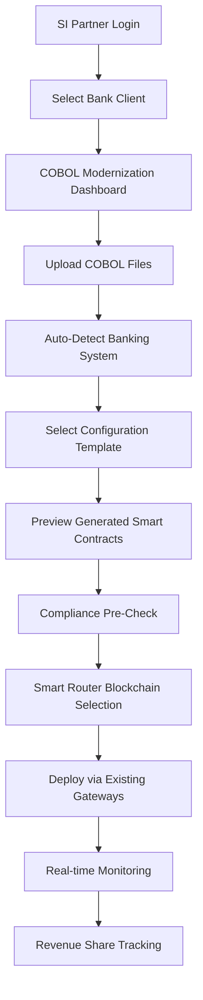
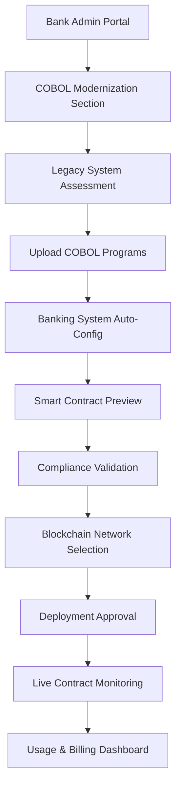
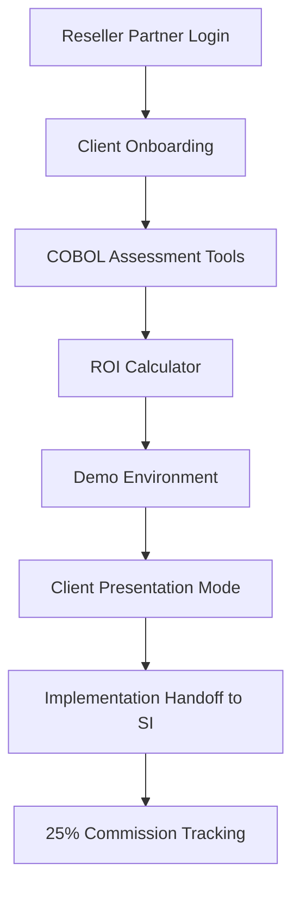

# 🏛️ **COBOL TRANSPILER INTEGRATION DOCUMENTATION**
## **LegacyBAAS Platform Enhancement: Enterprise COBOL Modernization**

**Version:** 1.0  
**Date:** July 4, 2025  
**Status:** Implementation Ready  
**Integration Approach:** Non-Redundant Extension of Existing LegacyBAAS Platform

---

# **📋 TABLE OF CONTENTS**

1. [**Integration Overview**](#integration-overview)
2. [**User Flow Architecture**](#user-flow-architecture)
3. [**Licensing & Business Model**](#licensing--business-model)
4. [**Technical Implementation Plan**](#technical-implementation-plan)
5. [**Testing Strategy for 100% Coverage**](#testing-strategy-for-100-coverage)
6. [**Implementation Phases**](#implementation-phases)
7. [**Success Metrics & KPIs**](#success-metrics--kpis)

---

# **🎯 INTEGRATION OVERVIEW**

## **Strategic Approach: Non-Redundant Integration**

The COBOL Transpiler will be integrated as a **specialized adapter** within the existing LegacyBAAS platform, leveraging 90% of existing infrastructure to avoid code redundancy while adding powerful COBOL modernization capabilities.

### **Integration Principles**

✅ **LEVERAGE EXISTING INFRASTRUCTURE:**
- Authentication system (OAuth2)
- Blockchain gateways (11+ networks)
- Banking connectors (FIS, Fiserv, Temenos, TCS BaNCS)
- Compliance engine (AML/KYC/sanctions)
- Smart router (AI-powered blockchain selection)
- Monitoring (Prometheus/Grafana)
- Partner portal framework

🆕 **ADD SPECIALIZED COMPONENTS:**
- COBOL parsing engine
- Template-based smart contract generation
- COBOL-specific API endpoints
- Enterprise dashboard extensions

### **Value Proposition**

| **Benefit** | **For Banks** | **For System Integrators** | **For LegacyBAAS** |
|-------------|---------------|----------------------------|-------------------|
| **Cost Reduction** | 90% lower than core system replacement | 90% faster project delivery | Additional $2K-$5K monthly revenue |
| **Risk Mitigation** | Preserve proven COBOL logic | Reusable templates across clients | Market expansion to $15B COBOL modernization |
| **Time to Market** | Weeks vs. years for modernization | 6 weeks vs. 6 months implementation | Enhanced partner loyalty |

---

# **🔄 USER FLOW ARCHITECTURE**

## **1. Three-Tier Access Model**

### **A. System Integrator Portal Flow**



**SI-Specific Features:**
- **Multi-Client Management**: Manage COBOL projects across multiple bank clients
- **Template Library**: Reusable configs for FIS, Fiserv, Temenos, TCS BaNCS
- **Revenue Dashboard**: Track 25-30% commission on implementations
- **Certification Tracking**: Monitor technical certification progress

### **B. Enterprise Bank Direct Flow**



**Enterprise-Specific Features:**
- **Self-Service Portal**: Non-technical staff can manage transpilation
- **Audit Trails**: SOC2-compliant logging for regulatory requirements
- **Custom SLAs**: Enterprise-grade service level agreements
- **Dedicated Support**: Direct access to technical specialists

### **C. Reseller Network Flow**



## **2. Portal Integration Architecture**

### **Enhanced Partner Portal Structure**
```
/partner-portal/
├── app/
│   ├── cobol-transpiler/          # NEW: COBOL-specific sections
│   │   ├── dashboard/             # Transpilation analytics
│   │   ├── templates/             # Banking system configs
│   │   ├── projects/              # Active transpilation projects
│   │   └── billing/               # Usage and revenue tracking
│   ├── enterprise/                # ENHANCED: Added COBOL features
│   ├── developer/                 # ENHANCED: COBOL SDK examples
│   └── partner/                   # ENHANCED: SI-specific tools
```

### **Role-Based Access Control**

```yaml
access_control:
  bank_admin:
    permissions:
      - upload_cobol_files
      - configure_banking_templates
      - approve_smart_contract_deployment
      - view_audit_trails
      - manage_usage_quotas
  
  si_developer:
    permissions:
      - transpile_for_clients
      - access_template_library
      - view_multi_client_analytics
      - manage_project_pipeline
  
  reseller_partner:
    permissions:
      - demo_environment_access
      - roi_calculator
      - lead_management
      - commission_tracking
  
  bank_user:
    permissions:
      - view_transpilation_status
      - download_generated_contracts
      - access_basic_monitoring
```

---

# **💰 LICENSING & BUSINESS MODEL**

## **1. Enhanced Pricing Tiers**

### **COBOL Transpiler Add-On Pricing**

| **Customer Tier** | **Base Platform** | **COBOL Add-On** | **Monthly Quota** | **Overage Rate** |
|-------------------|-------------------|------------------|-------------------|------------------|
| **Enterprise** | $5,000/month | +$2,000/month | 500 transpilations<br/>50 deployments | $10/transpilation<br/>$50/deployment |
| **Fortune 100** | $15,000/month | +$5,000/month | 2,000 transpilations<br/>200 deployments | $8/transpilation<br/>$40/deployment |
| **SI Partner** | Revenue Share | 30% commission | Unlimited | Based on client tier |

### **Implementation Services Pricing**

| **Service Type** | **SI Partner Fee** | **Direct Enterprise** | **Delivery Timeline** |
|------------------|-------------------|----------------------|----------------------|
| **COBOL Assessment** | $10K-$50K | $15K-$75K | 2-4 weeks |
| **Transpilation Project** | $50K-$200K | $75K-$300K | 4-8 weeks |
| **Blockchain Integration** | $100K-$500K | $150K-$750K | 8-16 weeks |
| **Training & Support** | $20K-$100K | $30K-$150K | Ongoing |

## **2. Partner Revenue Models**

### **System Integrator Commission Structure**
```yaml
si_revenue_model:
  platform_commission: 25-30%
  cobol_modernization_bonus: +5%
  implementation_fees:
    assessment: 25% of project value
    transpilation: 30% of project value
    integration: 35% of project value
  
recurring_benefits:
  monthly_platform_share: 25%
  support_services: 20%
  training_certification: $5K per developer
```

### **Reseller Network Model**
```yaml
reseller_revenue_model:
  initial_commission: 25%
  recurring_commission: 15%
  performance_bonuses:
    volume_tier_1: +2% (>5 clients/quarter)
    volume_tier_2: +5% (>15 clients/quarter)
    volume_tier_3: +10% (>30 clients/quarter)
```

### **Enterprise Direct Model**
```yaml
enterprise_direct:
  base_subscription: Premium tier pricing
  professional_services: $200-$400/hour
  custom_development: Project-based pricing
  dedicated_support: $50K-$200K annually
```

## **3. Usage-Based Billing Integration**

### **Automated Billing Calculation**
```javascript
const calculateMonthlyBill = (customer, usage) => {
  const baseFee = customer.tier.base_subscription;
  const cobolAddon = customer.features.cobol_transpiler.enabled ? 
    customer.tier.cobol_addon : 0;
  
  const overages = {
    transpilation: Math.max(0, usage.transpilations - customer.quota.transpilations) 
      * customer.tier.overage_rates.transpilation,
    deployment: Math.max(0, usage.deployments - customer.quota.deployments) 
      * customer.tier.overage_rates.deployment
  };
  
  return {
    base_fee: baseFee,
    cobol_addon: cobolAddon,
    overage_charges: overages.transpilation + overages.deployment,
    total: baseFee + cobolAddon + overages.transpilation + overages.deployment
  };
};
```

---

# **🔧 TECHNICAL IMPLEMENTATION PLAN**

## **1. Integration Architecture**

### **Non-Redundant Component Strategy**
```
LegacyBAAS Platform (Existing):
├── src/auth/                     ✅ REUSE: OAuth2 authentication
├── src/blockchain/               ✅ REUSE: 11+ blockchain gateways
├── src/connectors/               ✅ REUSE: Banking system connectors
├── src/compliance/               ✅ REUSE: AML/KYC/sanctions engine
├── src/router/                   ✅ ENHANCE: Add COBOL routing logic
├── src/monitoring/               ✅ REUSE: Prometheus/Grafana
├── src/adapters/                 🆕 ADD: cobol-transpiler.js
│   ├── enhanced-swift-parser.js  ✅ EXISTING
│   └── cobol-transpiler.js       🆕 NEW COMPONENT
└── src/api/                      ✅ ENHANCE: Add /banking/transpile
```

### **New Components Architecture**
```javascript
// src/adapters/cobol-transpiler.js
class CobolTranspiler {
  constructor(config) {
    this.config = config;
    this.swiftParser = new EnhancedSwiftParser(); // Leverage existing
    this.smartRouter = new SmartRouter();          // Leverage existing
    this.complianceEngine = new ComplianceEngine(); // Leverage existing
    this.templates = this._loadTemplates();
  }
  
  async transpile(cobolContent, bankingSystem) {
    // Parse COBOL into AST
    const ast = this.parseCobol(cobolContent);
    
    // Generate smart contract using templates
    const smartContract = this.generateContract(ast, bankingSystem);
    
    // Leverage existing smart router for blockchain selection
    const optimalNetwork = await this.smartRouter.selectNetwork({
      amount: ast.extractedAmount,
      complexity: ast.logicComplexity,
      compliance: ast.complianceRequirements
    });
    
    // Deploy via existing blockchain gateways
    return await this.deployContract(smartContract, optimalNetwork);
  }
}
```

## **2. API Enhancement Strategy**

### **Extended Banking API**
```javascript
// Extend existing /banking API with new endpoints
router.post('/banking/transpile', async (req, res) => {
  // Leverage existing authentication
  const user = await authenticate(req.headers.authorization);
  
  // Leverage existing compliance screening
  await complianceEngine.screenTransaction(req.body);
  
  // New transpilation logic
  const result = await cobolTranspiler.transpile(
    req.body.cobolFile,
    req.body.bankingSystem
  );
  
  // Leverage existing monitoring
  metrics.recordTranspilation(user.customerId, result);
  
  res.json(result);
});
```

## **3. Database Schema Extensions**

### **Enhanced Customer Configuration**
```sql
-- Extend existing customers table
ALTER TABLE customers ADD COLUMN cobol_features JSONB DEFAULT '{}';

-- Sample cobol_features structure:
{
  "enabled": true,
  "quota": {
    "transpilations_per_month": 1000,
    "deployments_per_month": 100
  },
  "banking_systems": ["fis_systematics", "tcs_bancs"],
  "preferred_blockchains": ["xrp", "corda"],
  "custom_templates": true
}
```

### **New Transpilation Tracking Tables**
```sql
CREATE TABLE transpilation_projects (
  id UUID PRIMARY KEY,
  customer_id UUID REFERENCES customers(id),
  project_name VARCHAR(255),
  cobol_files JSONB,
  banking_system VARCHAR(100),
  generated_contracts JSONB,
  deployment_status VARCHAR(50),
  created_at TIMESTAMP DEFAULT NOW(),
  updated_at TIMESTAMP DEFAULT NOW()
);

CREATE TABLE transpilation_usage (
  id UUID PRIMARY KEY,
  customer_id UUID REFERENCES customers(id),
  month_year VARCHAR(7), -- Format: '2025-07'
  transpilations_count INTEGER DEFAULT 0,
  deployments_count INTEGER DEFAULT 0,
  overage_charges DECIMAL(10,2) DEFAULT 0,
  created_at TIMESTAMP DEFAULT NOW()
);
```

---

# **🧪 TESTING STRATEGY FOR 100% COVERAGE**

## **1. Test Coverage Targets**

### **Maintain Existing 324/324 Test Coverage**
- ✅ **Current Platform**: 324 tests passing (100%)
- 🎯 **Enhanced Platform**: 400+ tests target (100%)
- 📊 **New Components**: 76+ additional tests required

### **Test Categories Breakdown**
```yaml
test_coverage:
  existing_platform: 324 tests (maintained)
  cobol_transpiler_core: 25 tests
  api_enhancements: 15 tests
  portal_integration: 20 tests
  billing_calculations: 10 tests
  end_to_end_workflows: 6 tests
  total_target: 400 tests
```

## **2. New Test Suites**

### **A. COBOL Transpiler Core Tests**
```javascript
describe('CobolTranspiler', () => {
  test('parses FIS Systematics COBOL correctly', async () => {
    const cobol = readTestFile('samples/fis_mortgage.cbl');
    const result = await transpiler.parse(cobol);
    expect(result.variables).toHaveLength(3);
    expect(result.logic).toContain('compute');
  });
  
  test('generates Solidity contract for Ethereum', async () => {
    const ast = mockCobolAST();
    const contract = await transpiler.generateContract(ast, 'solidity');
    expect(contract).toContain('pragma solidity ^0.8.0');
    expect(contract).toContain('contract Mortgage');
  });
  
  test('integrates with existing smart router', async () => {
    const mockTransaction = { amount: 1000, crossBorder: true };
    const network = await transpiler.selectOptimalNetwork(mockTransaction);
    expect(['xrp', 'corda', 'algorand']).toContain(network);
  });
});
```

### **B. API Integration Tests**
```javascript
describe('Enhanced Banking API', () => {
  test('POST /banking/transpile with authentication', async () => {
    const response = await request(app)
      .post('/banking/transpile')
      .set('Authorization', 'Bearer valid-token')
      .attach('cobolFile', 'test/samples/mortgage.cbl')
      .attach('config', 'test/configs/fis-ibs.yaml');
    
    expect(response.status).toBe(200);
    expect(response.body.code).toContain('contract Mortgage');
  });
  
  test('compliance screening integration', async () => {
    const transpilationData = mockTranspilationRequest();
    const result = await request(app)
      .post('/banking/transpile')
      .send(transpilationData);
    
    expect(result.body.compliance.approved).toBe(true);
    expect(result.body.compliance.riskScore).toBeLessThan(0.5);
  });
});
```

### **C. End-to-End Workflow Tests**
```javascript
describe('Complete COBOL Modernization Workflow', () => {
  test('FIS Systematics to XRP Ledger deployment', async () => {
    // 1. Upload COBOL file
    const uploadResult = await uploadCobolFile('fis_payment.cbl');
    
    // 2. Auto-configure banking system
    const config = await getAutoConfig(uploadResult.fileId);
    expect(config.core_type).toBe('FIS_IBS');
    
    // 3. Transpile to smart contract
    const transpileResult = await transpileFile(uploadResult.fileId, config);
    expect(transpileResult.blockchain).toBe('xrp');
    
    // 4. Deploy via existing XRP gateway
    const deployment = await deployContract(transpileResult.contractCode);
    expect(deployment.status).toBe('CONFIRMED');
    
    // 5. Verify monitoring integration
    const metrics = await getTranspilationMetrics();
    expect(metrics.totalTranspilations).toBeGreaterThan(0);
  });
});
```

## **3. Performance Testing**

### **Load Testing Targets**
```yaml
performance_targets:
  transpilation_time: "<30 seconds per COBOL file"
  api_response_time: "<500ms for /banking/transpile"
  concurrent_users: "100+ simultaneous transpilations"
  deployment_time: "<2 minutes smart contract deployment"
```

### **Performance Test Suite**
```javascript
describe('Performance Tests', () => {
  test('handles 100 concurrent transpilations', async () => {
    const promises = Array(100).fill().map(() => 
      request(app).post('/banking/transpile').send(mockRequest())
    );
    
    const results = await Promise.all(promises);
    const successCount = results.filter(r => r.status === 200).length;
    expect(successCount).toBeGreaterThanOrEqual(95); // 95% success rate
  });
});
```

---

# **📅 IMPLEMENTATION PHASES**

## **Phase 1: Foundation (Weeks 1-2)**

### **Week 1: Core Integration**
- [ ] **Task 1.1**: Create `src/adapters/cobol-transpiler.js`
- [ ] **Task 1.2**: Implement COBOL parsing engine
- [ ] **Task 1.3**: Create template system for smart contracts
- [ ] **Task 1.4**: Integrate with existing authentication system
- [ ] **Task 1.5**: Add 25 core transpiler tests

### **Week 2: API Enhancement**
- [ ] **Task 2.1**: Extend `/banking` API with transpilation endpoints
- [ ] **Task 2.2**: Integrate with existing compliance engine
- [ ] **Task 2.3**: Connect to existing smart router
- [ ] **Task 2.4**: Add 15 API integration tests
- [ ] **Task 2.5**: Database schema extensions

**Success Criteria:**
- ✅ Core transpilation functionality working
- ✅ 40+ new tests passing
- ✅ Integration with existing auth/compliance systems

## **Phase 2: Portal Integration (Weeks 3-4)**

### **Week 3: Partner Portal Enhancement**
- [ ] **Task 3.1**: Create COBOL dashboard components
- [ ] **Task 3.2**: Implement template library UI
- [ ] **Task 3.3**: Add project management interface
- [ ] **Task 3.4**: Integrate billing calculations
- [ ] **Task 3.5**: Add 20 portal integration tests

### **Week 4: Enterprise Features**
- [ ] **Task 4.1**: Implement role-based access control
- [ ] **Task 4.2**: Add audit logging for SOC2 compliance
- [ ] **Task 4.3**: Create usage dashboards
- [ ] **Task 4.4**: Implement quota management
- [ ] **Task 4.5**: Add 10 billing/usage tests

**Success Criteria:**
- ✅ Full portal integration complete
- ✅ Enterprise-grade features implemented
- ✅ 70+ total new tests passing

## **Phase 3: End-to-End Testing (Weeks 5-6)**

### **Week 5: Integration Testing**
- [ ] **Task 5.1**: Complete workflow testing (FIS, Fiserv, Temenos, TCS)
- [ ] **Task 5.2**: Performance testing (100+ concurrent users)
- [ ] **Task 5.3**: Security testing and penetration testing
- [ ] **Task 5.4**: Add 6 end-to-end workflow tests
- [ ] **Task 5.5**: Documentation updates

### **Week 6: Production Readiness**
- [ ] **Task 6.1**: Monitoring integration (Prometheus/Grafana)
- [ ] **Task 6.2**: Error handling and logging enhancements
- [ ] **Task 6.3**: Final performance optimization
- [ ] **Task 6.4**: SDK examples and documentation
- [ ] **Task 6.5**: Production deployment preparation

**Success Criteria:**
- ✅ 100% test coverage maintained (400+ tests)
- ✅ Production-ready deployment
- ✅ Complete documentation

---

# **📊 SUCCESS METRICS & KPIs**

## **1. Technical Metrics**

### **Platform Performance**
```yaml
technical_kpis:
  test_coverage: "100% (400+ tests)"
  transpilation_time: "<30 seconds average"
  api_response_time: "<500ms P95"
  deployment_success_rate: ">99%"
  system_uptime: ">99.95%"
```

### **Integration Quality**
```yaml
integration_metrics:
  code_reuse_percentage: ">90%"
  new_lines_of_code: "<5,000"
  existing_functionality_impact: "0 regressions"
  security_vulnerabilities: "0 critical, 0 high"
```

## **2. Business Metrics**

### **Revenue Impact**
```yaml
revenue_targets:
  month_1: "$50K additional MRR"
  month_3: "$150K additional MRR"
  month_6: "$400K additional MRR"
  year_1: "$2M additional ARR"
```

### **Customer Adoption**
```yaml
adoption_targets:
  pilot_customers: "5 enterprise banks"
  si_partners: "3 major SIs (TCS, Mphasis, Infosys)"
  transpilation_volume: "1,000+ COBOL files/month"
  success_rate: ">95% customer satisfaction"
```

## **3. Partner Metrics**

### **System Integrator Success**
```yaml
si_metrics:
  implementation_projects: "10+ active projects"
  revenue_share: "$500K+ quarterly commissions"
  certification_completion: "100% SI developer certification"
  project_delivery_time: "<6 weeks average"
```

### **Enterprise Customer Success**
```yaml
enterprise_metrics:
  cost_savings: "80%+ vs core system replacement"
  time_to_value: "<4 weeks from pilot to production"
  modernization_coverage: "50%+ legacy systems modernized"
  roi_achievement: ">300% within 12 months"
```

---

**Document Version:** 1.0  
**Last Updated:** July 4, 2025  
**Status:** Implementation Ready  
**Next Review:** Weekly during implementation phases